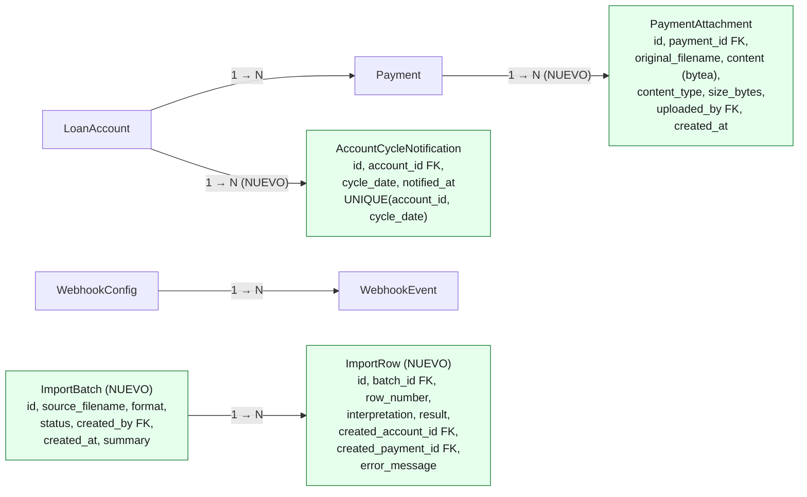
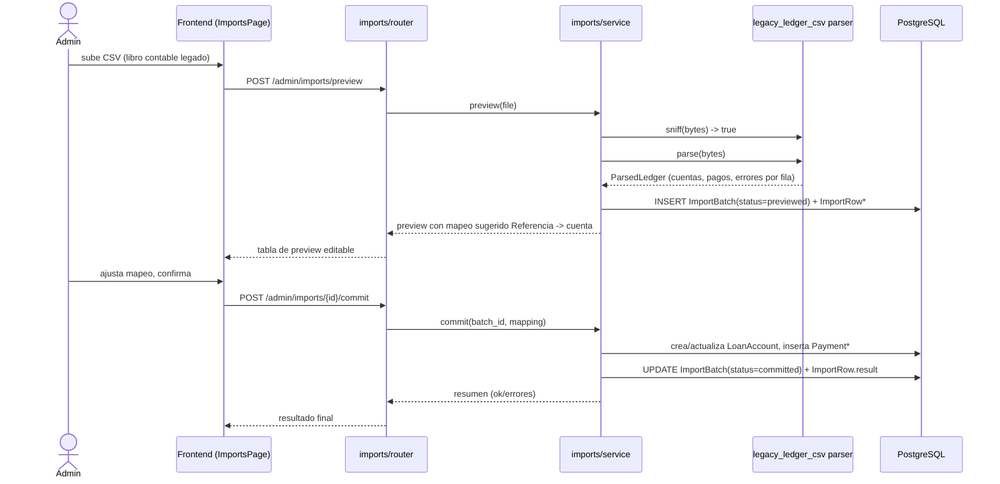

# Diagramas: Importación, adjuntos y webhooks de cierre de ciclo

Acompaña a `docs/requirements/001-import-attachments-cycle-webhooks.md` y
`002-...-plan.md`. Los nodos nuevos están marcados `NUEVO`; el resto ya existe
en el repo.

## 1. Componentes (delta sobre la arquitectura actual)

```mermaid
flowchart TB
    subgraph Backend["FastAPI backend"]
        direction TB
        accounts["modules/accounts"]
        payments["modules/payments"]
        webhooks["modules/webhooks"]
        admin["modules/admin"]
        imports["modules/imports NUEVO"]:::new
        cycleScan["webhooks/service.py\nCycleCloseScanService NUEVO"]:::new

        imports -->|crea Payment/LoanAccount, sin webhooks| payments
        imports -->|crea LoanAccount, sin webhooks| accounts
        cycleScan -->|lee ciclos de cuentas open/active| accounts
        cycleScan -->|encola cycle.closed| webhooks
        payments -->|encola payment.added\n(solo pagos en vivo, no import)| webhooks
    end

    subgraph Lifespan["FastAPI lifespan (asyncio, sin worker externo)"]
        retryLoop["_webhook_retry_loop() existente"]
        scanLoop["_cycle_close_scan_loop() NUEVO"]:::new
    end

    scanLoop --> cycleScan
    retryLoop --> webhooks

    subgraph Storage["Almacenamiento"]
        pg[("PostgreSQL (existente)\nincluye payment_attachments.content bytea\nNUEVO — sin volumen ni servicio aparte")]:::new
    end

    accounts --> pg
    payments --> pg
    webhooks --> pg
    imports --> pg

    classDef new fill:#e6ffed,stroke:#1a7f37,color:#1a1a1a;
```

## 2. Modelo de datos (delta)

Nota: se usa `flowchart` en vez de `erDiagram` porque el validador local de
este repo no puede confirmar correctamente diagramas Mermaid tipo
`erDiagram` (notación pata-de-gallo) sin un navegador headless disponible;
`flowchart` transmite las mismas cardinalidades 1→N con etiquetas explícitas
y sí se valida contra un renderer real.



`ImportRow.created_account_id` / `created_payment_id` son las referencias
lógicas hacia `LoanAccount`/`Payment` que el import haya creado — no se
dibujan como flechas aparte para no saturar el diagrama.

## 3. Secuencia: importación (preview → commit)



## 4. Secuencia: escaneo de cierre de ciclo (sin worker externo)

```mermaid
sequenceDiagram
    participant Loop as _cycle_close_scan_loop\n(asyncio task en lifespan)
    participant Svc as CycleCloseScanService
    participant Engine as interest_engine.get_cycle_dates
    participant DB as PostgreSQL
    participant Delivery as WebhookDeliveryService\n(loop existente)
    participant Target as Endpoint del cliente

    loop cada CYCLE_SCAN_INTERVAL_SECONDS
        Loop->>Svc: scan()
        Svc->>DB: SELECT cuentas open/active
        loop por cada cuenta
            Svc->>Engine: get_cycle_dates(start_date, until=hoy)
            Engine-->>Svc: fechas de ciclo
            Svc->>DB: filtrar fechas ya en account_cycle_notifications
            alt hay fechas nuevas
                Svc->>DB: INSERT account_cycle_notifications
                Svc->>DB: INSERT WebhookEvent(event=cycle.closed, status=pending)
            end
        end
    end

    Note over Delivery: proceso ya existente, sin cambios
    Delivery->>DB: SELECT WebhookEvent status=pending
    Delivery->>Target: POST payload firmado
    Target-->>Delivery: 2xx / error
    Delivery->>DB: UPDATE status=delivered/pending/failed
```
